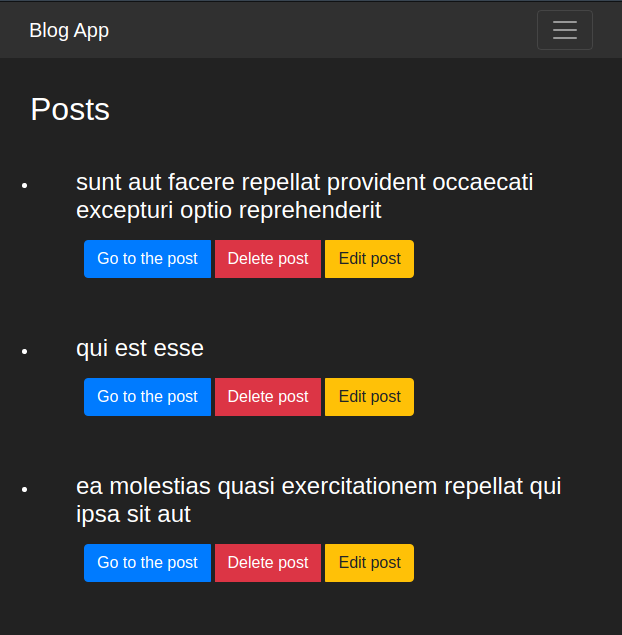

**# Screenshot:**

**# How To Run:**

1. Install Node.js
2. Clone the repository
3. Open a terminal and navigate to the root project folder
4. Now run `npm install` to install all dependencies 
5. Finally run `npm start` to run the app

**# Challenge:**
Resolution of the next [challenge](https://drive.google.com/file/d/1bKQ8trGxMo8cY4J9qlNyi9iIo4LYDNnv/view?usp=sharing)
